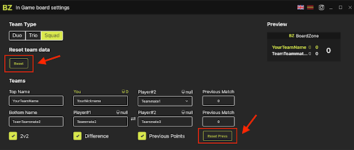

[![LinkedIn][linkedin-shield]][linkedin-url]

<!-- PROJECT LOGO -->
 

  

<h3 align="center">BoardZone</h3>

  

    This is an Overflow React chat app based in an idea that I had when I saw Call of Duty Warzone tournament streaming. 
      
    <!-- <a href="https://socketchat.surge.sh/">View Demo</a> -->
  

<!-- 

  

  -->

<!-- TABLE OF CONTENTS -->

  
Table of Contents

  <ol>
    <li>
      <a href="#about-the-project">About The Project</a>
      <ul>
        <li><a href="#built-with">Built With</a></li>
      </ul>
    </li>
    <li>
      <a href="#getting-started">Documentation</a>
      <ul>
        <li><a href="#prerequisites">What is BoardZone?</a></li>
        <li><a href="#prerequisites">What can you do with BoradZone?</a></li>
        <li><a href="#prerequisites">How to Use BoardZone?</a></li>
        <li><a href="#prerequisites">Out of Game</a></li>
        <li><a href="#prerequisites">Squads</a></li>
        <li><a href="#prerequisites">Team’s names</a></li>
        <li><a href="#prerequisites">Reset</a></li>
        <li><a href="#prerequisites">In Game</a></li>
      </ul>
    </li>
    <li><a href="#usage">BoardZone - FAQ</a>
    </li>
    <li><a href="#license">License</a></li>
    <li><a href="#contact">Contact</a></li>
  </ol>

<!-- ABOUT THE PROJECT -->
## About The Project

  

 
 

  This is the desktop menu of the app. In this menu the user can setting up the in-game board. This app is forked from a framework known as <a href="https://github.com/AlbericoD/overwolf-modern-react-boilerplate">Overwolf Modern React Boilerplate</a> and this framework is created for build apps to publish in the <a href="https://www.overwolf.com/">Overwolf</a> store. Overflow is a desktop app for windows to run other apps as an overlay in front games. In this case I tried to build a board to show the points of the team in a Call of Duty Warzone party in-game.

(<a href="#top">back to top</a>)

### Built With

* [React.js ⚛️](https://reactjs.org/)
* [Overwolf 🐺](https://www.overwolf.com/)
* [Overwolf Modern React Boilerplate](https://github.com/AlbericoD/overwolf-modern-react-boilerplate)
* [Overwolf Hooks](https://www.npmjs.com/package/overwolf-hooks)
* [Redux Tooltik](https://redux-toolkit.js.org/)
* [i18next](https://www.i18next.com/)

(<a href="#top">back to top</a>)

<!-- GETTING STARTED -->
## Documentation

### What is BoardZone?
BoardZone is an app that allows you to quickly and easily see the kills of your teammates and opponents while in-game and playing Warzone. It's the best tool for players who want to play wagers, tournaments or follow a record.

### What can you do with BoradZone?
<ul>
<li>Quickly see the number of kills of your teammates and opponents.</li>
<li>For the streamer, add a scoreboard in-game to show the kills to viewers.</li>
<li>Show the difference between your team and the other one.</li>
<li>See previous match kills and calculate the kills between the current match and the previous one.</li>
</ul>

### How to Use BoardZone?
BoardZone can be used both in-game and out of game. This article will show you how to make the most out of BoardZone step-by-step!
 
### Out of Game
When you are out of game you can easily set up your team to show the correct score board. You can set the team type between Duo, Trio and Squad. In the special case of Squads, you can change other settings. 
 

  

 
When you start the app you can see that there’s no data loaded, you have to launch Warzone and start a game to see your data and your team. The only thing you must set is the second player of your team, the rest of the team will be filled automatically. 

 

  

 

### Squads

 

  

 

If you select “Squads” as team type you will see that several new options appear above. 
<ul>
<li>
<strong>
2v2
</strong>
  
	If this is checked you will have two teams of two players separately and the other options appear. If it’s unchecked you are in a team of four players and all the kills will be summed up in one counter. This can be used to track the overall kills of the team following a record.
  </strong>
  <li>
  <strong>
Difference
</strong>
  
When this feature is checked the difference indicator shows up in the in-game board to show the difference in kills that the teams have. 
</li>
<li>
<strong>
Previous Points
</strong>
  
If you want to sum up the kills of previous matches of your current tournament/wager, you can check this option and will see that a new counter shows up on the board. The total difference will be updated with those previous points. The app will automatically update those values when a match ends, but if you want, you can edit the values directly from the “Previous Match” inputs.
</li>
</ul>

 

  

 

### Team’s names
The app will automatically fill up the team’s names but you can easily change it by editing the names directly from the inputs. 

 

  

 

### Reset
You can reset all the data if you want. After a few seconds the data will be updated automatically. 

 

  

 

 If you want to reset the points of the previous matches you can click the “Reset Prevs” button.

### In Game
When you launch the game you can see the in game overlay, the board itself. Here, you will see all the important information to keep track. The green row, the top one, has all the data of your team. You can see the name of your team, the kills of the previous matches and the kills of the current match. Then if you have enabled, you will see the difference of kills between your team and the other one. 

 

  

 

### BoardZone - FAQ
This article will list possible questions and answers regarding BoardZone, we hope you find what you need!

The in-game window doesn't appear!, what to do?
This happens when you close the app and try to launch it again but you never relaunch the game. To solve this, you have to close the game and run it again with the app opened. You can also try resetting Overwolf. Sorry for the inconvenience, we are working to improve some features.
The In-Game board isn’t at the correct position, what to do?
If you want to position the in-game board, you must press the keys ctrl+tab and you can freely move the board to the desired position. Once you are ready, press again.

<!-- LICENSE -->
## License

Distributed under the MIT License. See `LICENSE.txt` for more information.

(<a href="#top">back to top</a>)

<!-- CONTACT -->
## Contact

Nicolás Tonelli - nicolastonelli1406@gmail.com

Project Link: [https://github.com/mocca-dev/boardzone.git](https://github.com/mocca-dev/boardzone.git)

(<a href="#top">back to top</a>)

<!-- MARKDOWN LINKS & IMAGES -->
<!-- https://www.markdownguide.org/basic-syntax/#reference-style-links -->
[contributors-shield]: https://img.shields.io/github/contributors/github_username/repo_name.svg?style=for-the-badge
[contributors-url]: https://github.com/github_username/repo_name/graphs/contributors
[forks-shield]: https://img.shields.io/github/forks/github_username/repo_name.svg?style=for-the-badge
[forks-url]: https://github.com/github_username/repo_name/network/members
[stars-shield]: https://img.shields.io/github/stars/github_username/repo_name.svg?style=for-the-badge
[stars-url]: https://github.com/github_username/repo_name/stargazers
[issues-shield]: https://img.shields.io/github/issues/github_username/repo_name.svg?style=for-the-badge
[issues-url]: https://github.com/github_username/repo_name/issues
[license-shield]: https://img.shields.io/github/license/github_username/repo_name.svg?style=for-the-badge
[license-url]: https://github.com/github_username/repo_name/blob/master/LICENSE.txt
[linkedin-shield]: https://img.shields.io/badge/-LinkedIn-black.svg?style=for-the-badge&logo=linkedin&colorB=555
[linkedin-url]: https://linkedin.com/in//nicolás-tonelli-181624b9/
[product-screenshot]: images/screenshot.png